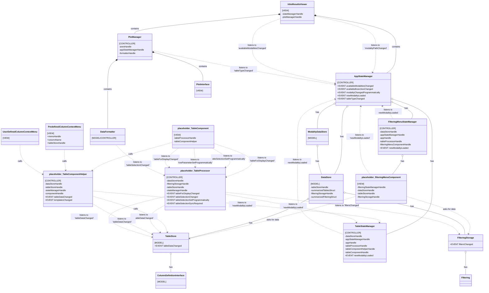

```mermaid
classDiagram

    %% UI components
    class IrbisResultsViewer {
        [VIEW]
        -stateManagerHandle
        -plotManagerHandle
    }

    class placeholder_filteringMenuComponent {
        [VIEW]
        -filteringStateManagerHandle
        -dataStoreHandle
        -tableStoreHandle
        -filteringStorageHandle
    }

    class placeholder_TableComponent {
        [VIEW]
        -tableProcessorHandle
        -tableComponentHelper
    }


    %% Classes
    class AppStateManager {
        [CONTROLLER]
        +EVENT availableModalitiesChanged
        +EVENT availableBranchesChanged
        +EVENT modalityChangedProgrammatically
        +EVENT newModalityLoaded
        +EVENT tableTypeChanged
    }

    class ColumnDefinitionInterface {
        [MODEL]
    }

    class DataFormatter {
        [MODEL/CONTROLLER]
    }

    class DataStore {
        [MODEL]
        -tableStoreHandle
        -summarizedTablesStruct
        -filteringStorageHandle
        -summarizedFilteringStruct
    }

    class Filtering {
    }

    class FilteringStorage {
        +EVENT filtersChanged

    }

    class FilteringMenuStateManager {
        [CONTROLLER]
        -dataStoreHandle
        -appStateManagerHandle
        -appHandle
        -tableProcessorHandle
        -filteringMenuComponentHandle
        +EVENT: newModalityLoaded
    }

    class ModalityDataStore {
        [MODEL]
    }

    class PlotInterface {
        [VIEW]
    }

    class placeholder_TableProcessor {
        [CONTROLLER]
        -dataStoreHandle
        -filteringStorageHandle
        -tableStoreHandle
        -stateManagerHandle
        +EVENT tableForDisplayChanged
        +EVENT tableSelectionChanged
        +EVENT tableSelectionSetProgrammatically
        +EVENT tableSelectionSyncRequired
    }

    class placeholder_TableComponentHelper {
        [CONTROLLER]
        -dataStoreHandle
        -tableStoreHandle
        -stateManagerHandle
        -componentHandle
        +EVENT tableDataChanged
        +EVENT templatesChanged  
    }

    class PlotManager {
        [CONTROLLER]
        -axesHandle
        -appStateManagerHandle
        -formatterHandle     
    }

    class PredefinedColumnContextMenu {
        [VIEW]
        +menuHandle
        +columnName
        +tableStoreHandle
    }

    class TableStateManager {
        [CONTROLLER]
        -dataStoreHandle
        -appStateManagerHandle
        -appHandle
        -tableProcessorHandle
        -tableComponentHelperHandle
        -tableComponentHandle
        +EVENT newModalityLoaded
    }

    class TableStore {
        [MODEL]
        +EVENT tableDataChanged
    }

    class UserDefinedColumnContextMenu {
        [VIEW]
    }

    %% Relationships with the visual components
    IrbisResultsViewer *-- AppStateManager : contains
    IrbisResultsViewer *-- PlotManager : contains

    placeholder_filteringMenuComponent ..> TableStore : asks for data
    placeholder_filteringMenuComponent ..> FilteringStorage : asks for data

    %% Composition/Aggregation Relationships
    AppStateManager o-- ModalityDataStore : has
    AppStateManager o-- DataStore : has
    AppStateManager o-- TableStateManager : has
    AppStateManager o-- FilteringMenuStateManager : has

    DataStore o-- TableStore : has
    DataStore o-- FilteringStorage : has
    FilteringMenuStateManager o-- placeholder_filteringMenuComponent : has
    FilteringStorage o-- Filtering : has
    ModalityDataStore o-- DataStore : has
    PlotManager *-- DataFormatter : contains
    PlotManager *-- PlotInterface : contains
    TableStore o-- ColumnDefinitionInterface: has

    %% Dependencies/Usage Relationships
    placeholder_TableComponent ..> placeholder_TableComponentHelper : calls
    placeholder_TableComponentHelper ..> TableStore: calls

    PredefinedColumnContextMenu ..> placeholder_TableComponentHelper : calls
    UserDefinedColumnContextMenu ..> placeholder_TableComponentHelper : calls


    %% Listeners
    FilteringMenuStateManager ..> AppStateManager : listens to newModalityLoaded
    placeholder_TableProcessor ..> TableStore : listens to 'tableDataChanged'

    IrbisResultsViewer ..> AppStateManager : listens to 'modalityPathChanged'

    IrbisResultsViewer ..> AppStateManager : listens to 'availableModalitiesChanged'
    
    placeholder_filteringMenuComponent ..> AppStateManager : listens to 'newModalityLoaded'

    placeholder_TableComponent ..> placeholder_TableProcessor : listens to 'tableForDisplayChanged'
    placeholder_TableComponent ..> placeholder_TableProcessor : listens to 'tableSelectionSetProgrammatically'
    placeholder_TableComponent ..> placeholder_TableProcessor : listens to 'rowParameterSetProgrammatically'

    placeholder_TableComponentHelper ..> TableStateManager : listens to 'newModalityLoaded'
    placeholder_TableComponentHelper ..> TableStore : listens to 'tableDataChanged' 

    placeholder_TableProcessor ..> TableStateManager : listens to 'newModalityLoaded'
    placeholder_TableProcessor ..> FilteringStorage : listens to 'filtersChanged'
    placeholder_TableProcessor ..> TableStore : listens to 'tableDataChanged'

    PlotManager ..> AppStateManager : listens to 'tableTypeChanged'

    placeholder_TableComponent ..> placeholder_TableProcessor : listens to 'tableForDisplayChanged'

    DataFormatter ..> placeholder_TableProcessor : listens to 'tableSelectionChanged'

    TableStateManager ..> AppStateManager : listens to newModalityLoaded
```
