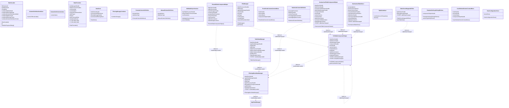

```mermaid
classDiagram

    class BatchLoader {
        +fileNamesAll
        +pathNamesAll
        +modalities
        +combinedTablesModel
        +combinedFilteringsModel
        +combinedColumnDefinitionsModel
        +combinedTablesTracks
        +combinedFilteringsTracks
        +combinedColumnDefinitionsTracks
        +BatchLoader()
        -j()
        +initializeProgressDialog()
    }

    class ColumnDefinitionCombiner {
        +namesToRecalculate()
    }

    class ColumnDefinitionInterface {
        +columnName
    }

    class DataFormatter {
        +plotManagerHandle
        +tableProcessorHandles
        +useGrouping
        +useIndividual
        +requiredParametersNum
        +tableTypes
        +listener
        +lastProcessedData
        +storedLastSource
        +X_COLUMN_NUM
        +Y_COLUMN_NUM
        +DataFormatter()
    }

    class DataStore {
        +tableStoreHandle
        +summarizedTablesStruct
        +filteringStorageHandle
        +summarizedFilteringStruct
        +DataStore()
    }

    class FilteringMenuStateManager {
        +dataStoreHandle
        +appStateManagerHandle
        +appHandle
        +tableType
        +tableProcessorHandle
        +filteringMenuComponentHandle
        +gridRowNum
        +stateManagerListener
        +FilteringMenuStateManager()
        + EVENT: newModalityLoaded
    }

    class FilteringStorageCombiner {
        +combineStorage()
    }

    class FormulaColumnDefinition {
        +formulaString
        +definitionType
        +FormulaColumnDefinition()
    }

    class FullTableComponentHelper {
        +dataStoreHandle
        +tableStoreHandle
        +stateManagerHandle
        +componentHandle
        +treeHandle
        +activeColumns
        +templateNames
        +templates
        +tableStoreListener
        +stateManagerListener
        +templateFileName
        +FullTableComponentHelper()
        -getUnusedNameCopy()
        + EVENT: tableDataChanged
        + EVENT: templatesChanged
    }

    class ManualColumnDefinition {
        +groupNames
        +definitionType
        +ManualColumnDefinition()
    }

    class MultitableSynchronizer {
        +topTableProcessorHandle
        +bottomTableProcessorHandle
        +rowParameter
        +MultitableSynchronizer()
        -sourceTableId()
    }

    class PivotedTableComponentHelper {
        +dataStoreHandle
        +tableStoreHandle
        +stateManagerHandle
        +componentHandle
        +groupedDataParameter
        +columnParameter
        +rowParameter
        +tableStoreListener
        +stateManagerListener
        +PivotedTableComponentHelper()
    }

    class PlotManager {
        +tableProcessorHandles
        +tableTypes
        +appStateManagerHandle
        +axesHandle
        +formatter
        +plotType
        +useGrouping
        +useIndividual
        +requiredParametersNum
        +PlotManager()
        -getPlotter()
    }

    class PredefinedColumnContextMenu {
        +nodeHandle
        +menuHandle
        +columnName
        +componentHelperHandle
        +PredefinedColumnContextMenu()
    }

    class StatisticalColumnDefinition {
        +groupingParameter
        +dataParameter
        +columnParameter
        +innerAggregationFunction
        +outerAggregationFunction
        +StatisticalColumnDefinition()
    }

    class SummarizedTableComponentHelper {
        +dataStoreHandle
        +tableStoreHandle
        +summarizedTableStoreHandle
        +tableStateManagerHandle
        +componentHandle
        +treeHandle
        +activeColumns
        +rowParameter
        +tableStoreListener
        +summarizedTableListener
        +stateManagerListener
        +SummarizedTableComponentHelper()
        + EVENT: tableDataChanged
    }

    class SummarizedTableStore {
        +groupingName
        +parentColumnNames
        +parentColumnTypes
        +columnDefinitionHandles
        +userDefinedColumnNames
        +tableStoreHandle
        +userColumnDefinitionsHandle
        +cachedTableData
        +tableStoreListener
        +SummarizedTableStore()
        + EVENT: tableDataChanged
    }

    class TableCombiner {
        +combineAcrossTimepoints()
        -classes()
    }

    class TableStateManager {
        +dataStoreHandle
        +appStateManagerHandle
        +appHandle
        +tableType
        +tableProcessorHandle
        +tableComponentHelperHandle
        +tableComponentHandle
        +gridRowNum
        +stateManagerListener
        +TableStateManager()
        + EVENT: newModalityLoaded
    }

    class TableStoreWrappedInFilter {
        +tableStoreHandle
        +filteringStorageHandle
        +TableStoreWrappedInFilter()
        +newTableData()
        + EVENT: tableDataChanged
    }

    class TemplateSettingsDialogWindow {
        +componentHelperHandle
        +TemplateSettingsDialogWindow()
        -columnTypeDropDown()
    }

    class UserDefinedColumnContextMenu {
        +nodeHandle
        +menuHandle
        +columnName
        +componentHelperHandle
        +UserDefinedColumnContextMenu()
    }

    class ViewConfigurationStore {
        +storedViews
        +ViewConfigurationStore()
    }

    FilteringMenuStateManager ..> AppStateManager : listens to newModalityLoaded
    FullTableComponentHelper ..> FilteringMenuStateManager : listens to newModalityLoaded
    FullTableComponentHelper ..> FullTableComponentHelper : listens to tableDataChanged
    PivotedTableComponentHelper ..> FilteringMenuStateManager : listens to newModalityLoaded
    PivotedTableComponentHelper ..> FullTableComponentHelper : listens to tableDataChanged
    SummarizedTableComponentHelper ..> FilteringMenuStateManager : listens to newModalityLoaded
    SummarizedTableComponentHelper ..> FullTableComponentHelper : listens to tableDataChanged
    SummarizedTableComponentHelper ..> FullTableComponentHelper : listens to tableDataChanged
    SummarizedTableStore ..> FullTableComponentHelper : listens to tableDataChanged
    TableStateManager ..> FilteringMenuStateManager : listens to newModalityLoaded
    TableStoreWrappedInFilter ..> FullTableComponentHelper : listens to tableDataChanged
```
